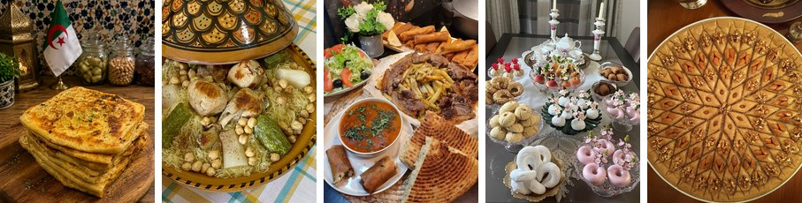

# Algerian Food 🍲

Algerian cuisine is rich and varied. Each region has its own dishes, ingredients and ways of cooking.

Food is also an important part of family life in Algeria. Many traditional dishes are prepared for celebrations, religious holidays or simply for family meals.

## Couscous

Couscous is probably one of the most famous Algerian dishes. It is made with semolina and is usually served with vegetables, meat and a sauce.

There are many different ways to prepare couscous depending on the region and the family.

> Couscous is more than a dish. It is often associated with family gatherings and traditions.

## Rechta

**Rechta** is a traditional Algerian dish made with thin noodles. It is usually served with a white sauce, chicken, chickpeas and vegetables.

It is especially popular in Algiers and is often prepared for special occasions.

## Mhajeb

*Mhajeb* are made from semolina dough and filled with a mixture of tomatoes, onions and spices.

They are popular as street food but can also be easily prepared at home.

## Bourek

Bourek is another popular Algerian food. It is made with thin pastry sheets and can have different fillings.

Some common fillings are:

* Minced meat
* Cheese
* Potatoes
* Tuna
* Chicken

Bourek is especially popular during **Ramadan**.

## Algerian Sweets 🍯

Algeria also has many traditional sweets and pastries.

Some of the most popular ones include:

1. Makrout
2. Baklava
3. Kalb el Louz
4. Tcharek
5. Griwech

They are often prepared for celebrations, Eid and other special occasions.

## A Small Algerian Menu

| Dish | Type | Main ingredients |
| --- | --- | --- |
| Couscous | Main dish | Semolina, vegetables and meat |
| Rechta | Main dish | Noodles, chicken and chickpeas |
| Mhajeb | Street food | Semolina, tomato and onion |
| Bourek | Starter | Pastry and different fillings |
| Makrout | Sweet | Semolina, dates and honey |

## My Choice ❤️

If I had to choose one Algerian meal, I would choose **Rechta** because there are so many different versions of it across Algeria.

For something sweet, my choice would be *Makrout* with a cup of tea.

---

[🏠 Home](index.md) | [🏞️ Places](places.md) | [🧿 Culture](culture.md) | [🍲 Food](food.md)
