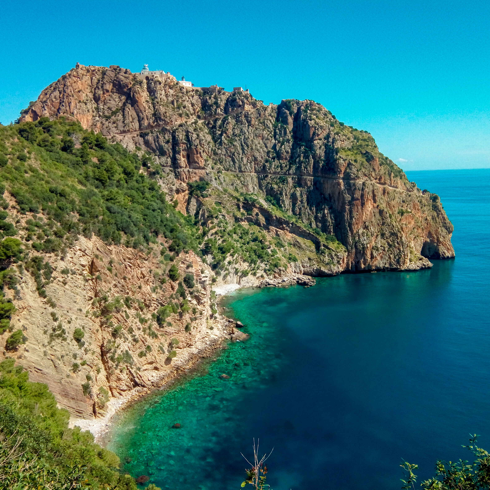
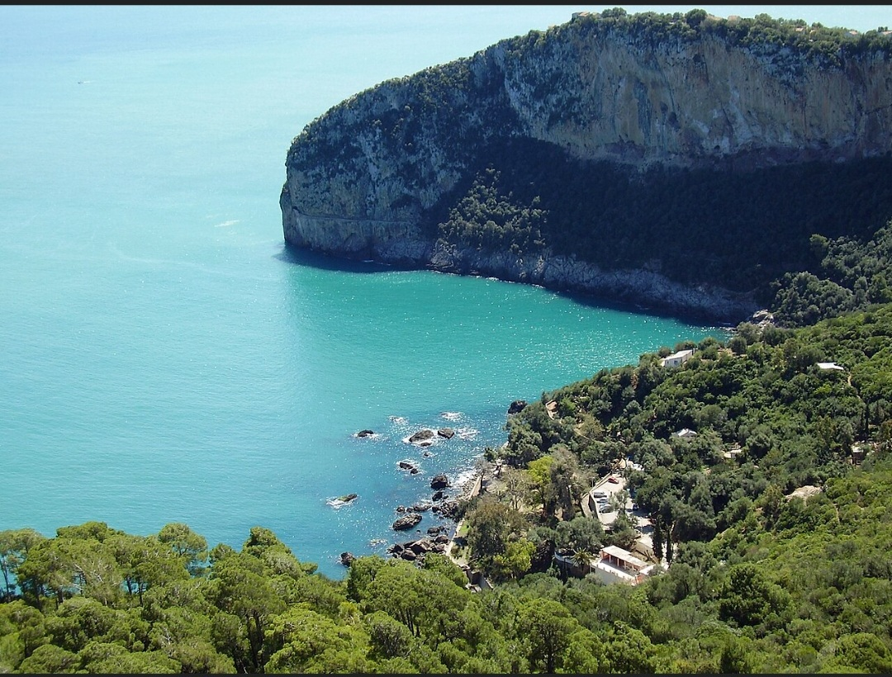
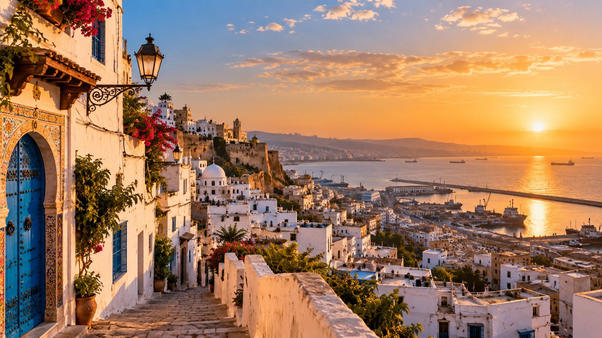
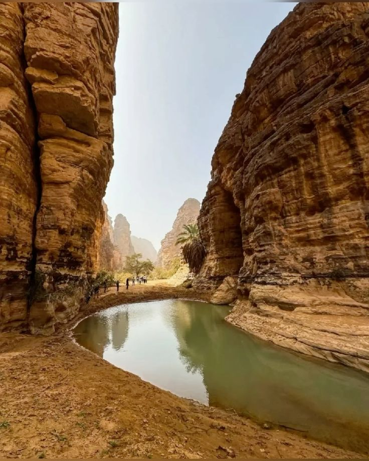
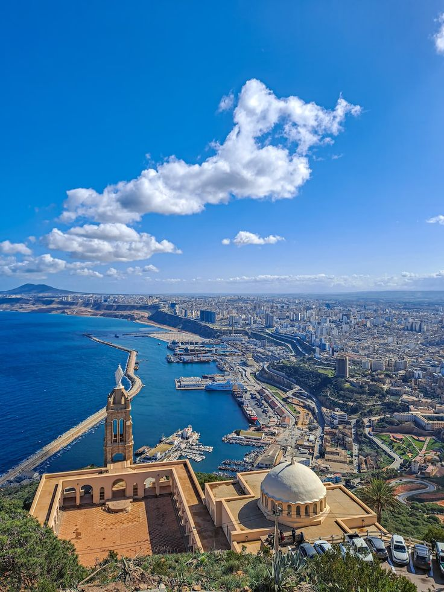

# Places to Discover in Algeria 🇩🇿

Algeria is the largest country in Africa and has many different landscapes. You can find beaches, mountains, big cities and of course the Sahara Desert.

Here are some places that I think are worth discovering.

## Béjaïa 🌊

Béjaïa is a coastal city in the north of Algeria. It is surrounded by the Mediterranean Sea and mountains.

Some places to visit in Béjaïa are:

* Cap Carbon
* Yemma Gouraya
* Les Aiguades
* The old city

Béjaïa is especially known for its beautiful natural landscapes.

## Algiers 🏛️

Algiers is the **capital of Algeria**. The city is known for its white buildings and its location by the Mediterranean Sea.

One of its most famous places is the *Casbah of Algiers*, which is part of the UNESCO World Heritage List.

Other places to discover include:

1. The Martyrs' Memorial
2. The Botanical Garden of Hamma
3. Notre Dame d'Afrique
4. The Casbah

## The Sahara 🏜️

The Sahara covers a large part of Algeria and offers a completely different landscape from the north of the country.

> The Algerian Sahara is not only a desert. It is also home to history, traditions and different communities.

Places such as **Tamanrasset**, **Djanet** and **Tassili n'Ajjer** are known for their landscapes.

## Oran 🌅

Oran is an important city in western Algeria. It is particularly famous for its music and its Mediterranean atmosphere.

Oran is also closely associated with **Raï music**, one of the most famous Algerian musical genres.

## Which one would I recommend?

If I had to recommend one region to discover first, I would choose **Béjaïa** because it combines the sea, mountains and Algerian culture.It is also my hometown, so it has a special place in my heart.

---

[🏠 Home](index.md) | [🏞️ Places](places.md) | [🧿 Culture](culture.md) | [🍲 Food](food.md)
